# Hangman - Game

# Introduction
Project milestone 3 for Code Institute Full-stack development program: Python Terminal.
Hangman is a Python terminal game, which runs in the Code Institute mock terminal on Heroku. The main goal of the game is to guess letters in order to find the word that the computer randomly selects. This project was inspired by the pencil guessing game for two or more players. 
According to the site Gambiter, this game has been around since 1894 under the name "Birds, Beasts, and Fishes".

[Live Project Here](https://portfolio-project-3.herokuapp.com/)

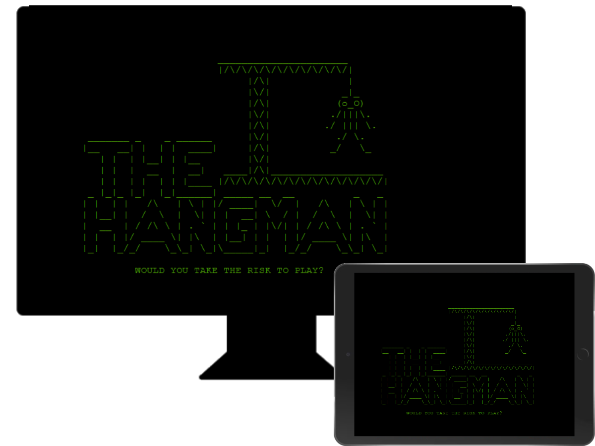

## README Table Content

- [Hangman - Game](#hangman---game)
- [Introduction](#introduction)
  - [README Table Content](#readme-table-content)
  - [User Experience - UX](#user-experience---ux)
    - [User Stories](#user-stories)
  - [Design](#design)
      - [Colours](#colours)
      - [Typography](#typography)
    - [Flowcharts](#flowcharts)
  - [Features](#features)
    - [Logo and Intro Message](#logo-and-intro-message)
    - [Ask Player Name and City](#ask-player-name-and-city)
      - [Empty Input for Name and City](#empty-input-for-name-and-city)
    - [Welcome Message and Game Rules](#welcome-message-and-game-rules)
  - [Game Features](#game-features)
    - [Hangman Stage 1](#hangman-stage-1)
    - [Hangman Stage 2](#hangman-stage-2)
    - [Hangman Stage 3](#hangman-stage-3)
    - [Hangman Stage 4](#hangman-stage-4)
    - [Hangman Stage 5](#hangman-stage-5)
    - [Hangman Stage 6](#hangman-stage-6)
    - [Hangman Stage 7](#hangman-stage-7)
    - [Hangman Stage 8 - Lose](#hangman-stage-8---lose)
    - [Hangman Stage 9 - Win](#hangman-stage-9---win)
    - [Hangman Stage 10 - Win Extra](#hangman-stage-10---win-extra)
    - [Menu Options](#menu-options)
    - [Leaderboard](#leaderboard)
    - [Exit Game](#exit-game)
  
- [Hangman - Game](#hangman---game)
- [Introduction](#introduction)
  - [README Table Content](#readme-table-content)
  - [User Experience - UX](#user-experience---ux)
    - [User Stories](#user-stories)
  - [Design](#design)
      - [Colours](#colours)
      - [Typography](#typography)
    - [Flowcharts](#flowcharts)
  - [Features](#features)
    - [Logo and Intro Message](#logo-and-intro-message)
    - [Ask Player Name and City](#ask-player-name-and-city)
      - [Empty Input for Name and City](#empty-input-for-name-and-city)
    - [Welcome Message and Game Rules](#welcome-message-and-game-rules)
  - [Game Features](#game-features)
    - [Hangman Stage 1](#hangman-stage-1)
    - [Hangman Stage 2](#hangman-stage-2)
    - [Hangman Stage 3](#hangman-stage-3)
    - [Hangman Stage 4](#hangman-stage-4)
    - [Hangman Stage 5](#hangman-stage-5)
    - [Hangman Stage 6](#hangman-stage-6)
    - [Hangman Stage 7](#hangman-stage-7)
    - [Hangman Stage 8 - Lose](#hangman-stage-8---lose)
    - [Hangman Stage 9 - Win](#hangman-stage-9---win)
    - [Hangman Stage 10 - Win Extra](#hangman-stage-10---win-extra)
    - [Menu Options](#menu-options)
    - [Leaderboard](#leaderboard)
    - [Exit Game](#exit-game)

## User Experience - UX

### User Stories

* As a website creator, I want to:
  
1. Build an easy app for the users to play the game
2. Build a game that is both enjoyable and challenging for the players
   
* As a new visitor, I want to:

1. Be able to understand the purpose of the App and start a new game
2. Be able to follow the score, see the wrong and right letters appear once I take a turn, and see how many tries remain before the game is over
3. Be able to watch my results and other players' results on the Leaderboard
   
* As a returning visitor, I want to:

1. Be able to play the game again with a different word as chosen by the computer
2. Be challenged and try to improve on my previous scores. 
3. Compare my scores with other users on the Leaderboard
   
## Design

#### Colours
* The colours in the game are supplied by the Python Colorama Model

#### Typography
* The Arial is used as the main font for the whole project

### Flowcharts 
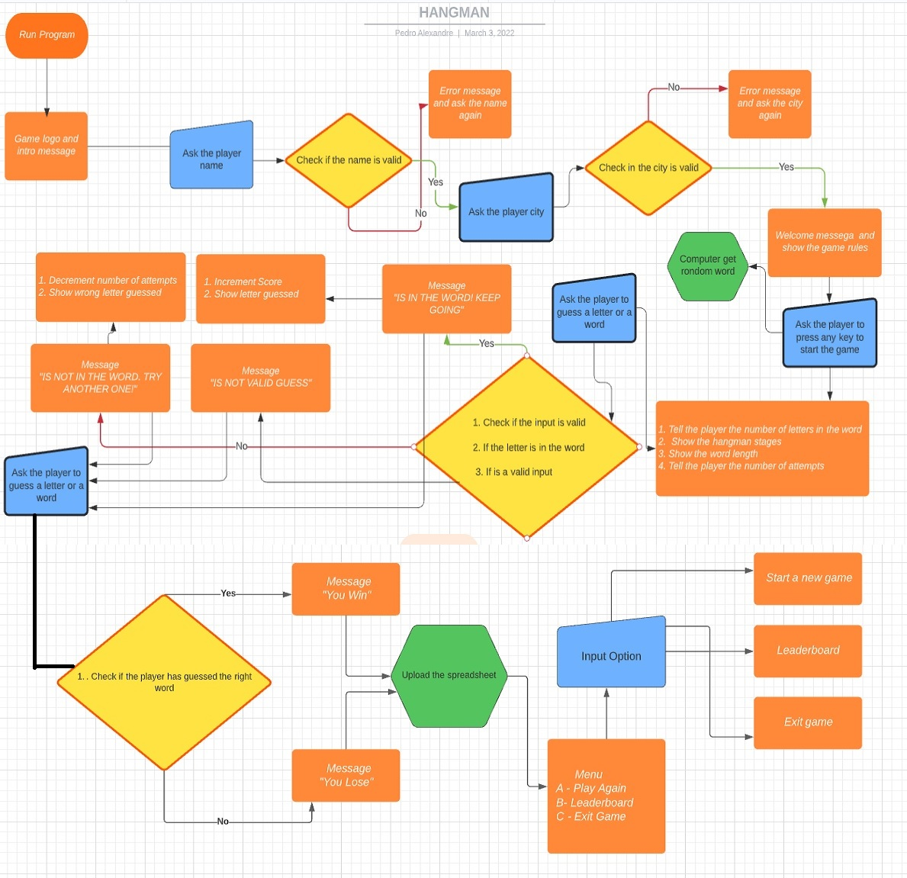 
I spent time planning and thinking about the logic and flow behind the game to ensure I had a general idea of how it could be built. I created flowcharts to assist me with the logical flow throughout the application. The charts were generated using [Lucidchart](https://lucid.app/) Integration and are shown below. 

## Features

### Logo and Intro Message

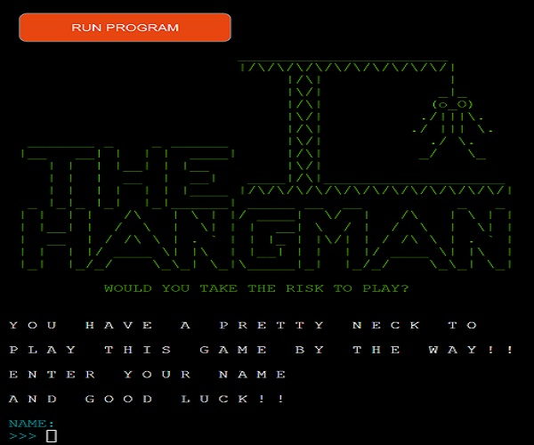

* When the users reach the website, they will see this feature. The game logo and the intro message are displayed here. 

### Ask Player Name and City

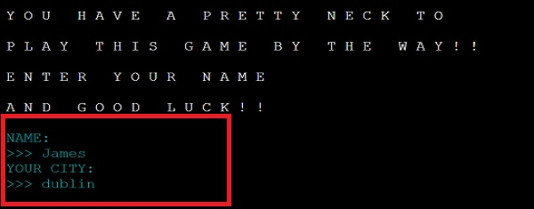
* After the player sees the intro feature the computer will ask the user's to input their name and city. 

#### Empty Input for Name and City
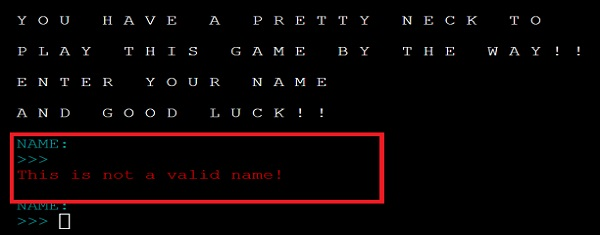
* If the player does not input their name and city this alert will appear. 

### Welcome Message and Game Rules
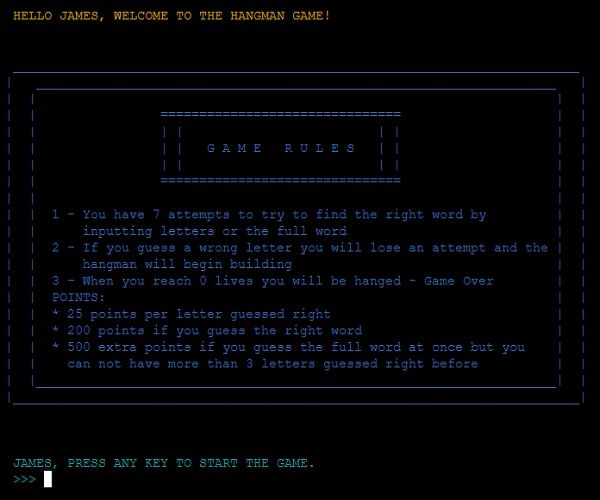
* After the user inputs their name and city, the program will display the welcome message and the game rules. The player then presses any key to start the game. 

## Game Features

### Hangman Stage 1
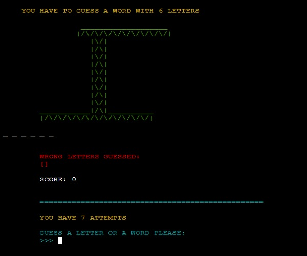  

This feature displays where the main scene happens. Here the user can play and see the following information about the game:
* Numbers of letters choosen by the computer 
* Hangman stages
* Letters guessed right
* Letters guessed wrong
* Current score
* Current number of attempts
* Input to guess a letter or a full word
* Input letters to either guess a letter only or the full word

### Hangman Stage 2 

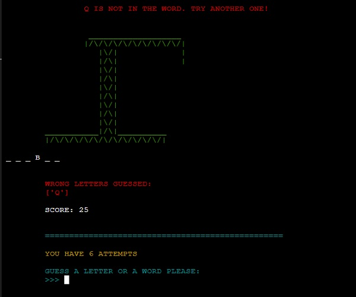  
Any time the player guesses a wrong letter, a part of the hangman appears
* 1 letter guessed wrong, the player will see the hangman and the first part of the hangman:  a rope, in green.

### Hangman Stage 3

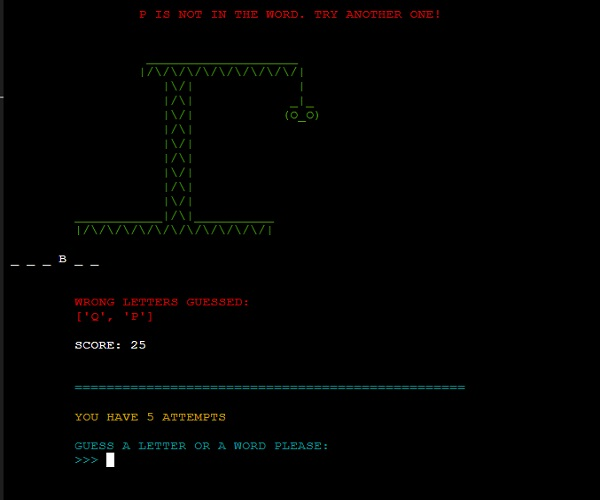
* 2 letters guessed wrong the player will see the hangman and 2 parts of the hangman a rope and head in green.

### Hangman Stage 4

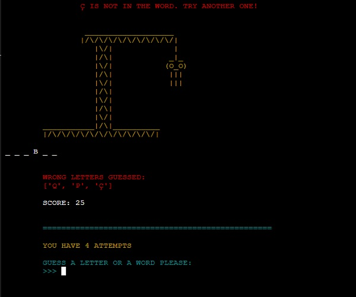
* 3 letters guessed wrong the player will see the hangman and 3 parts of the hangman rope, head and torso in yellow.

### Hangman Stage 5

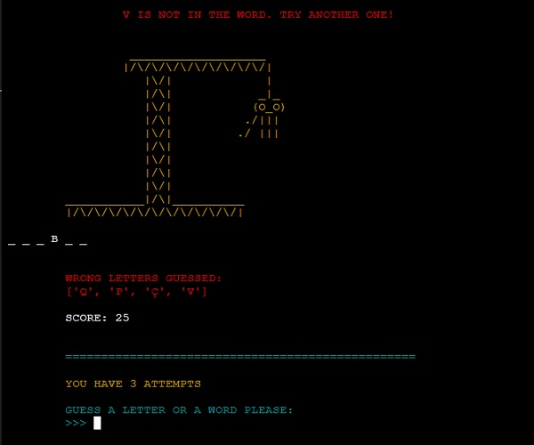
* 4 letters guessed wrong the player will see the hangman and 4 parts of the hangman rope, head, torso and the right arm in yellow.

### Hangman Stage 6

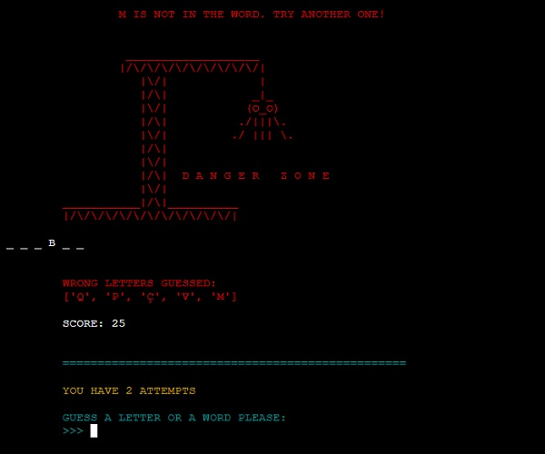
* 5 letters guessed wrong the player will see the hangman and 5 parts of the hangman, rope, head, torso and both arms in red. Also the "Danger Zone" will be displayed.

### Hangman Stage 7

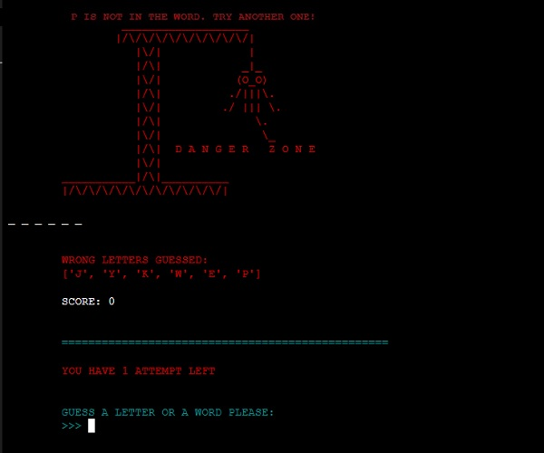
* 6 letters guessed wrong and the player will see the hangman and 6 parts of the hangman rope, head, torso, both arms and left leg in red. Also the alert message "Danger Zone" will be displayed.

### Hangman Stage 8 - Lose

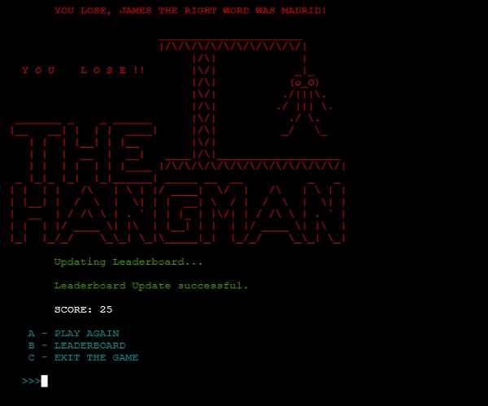
* 7 letters guessed wrong the player will see the full hangman and the game is over.

### Hangman Stage 9 - Win

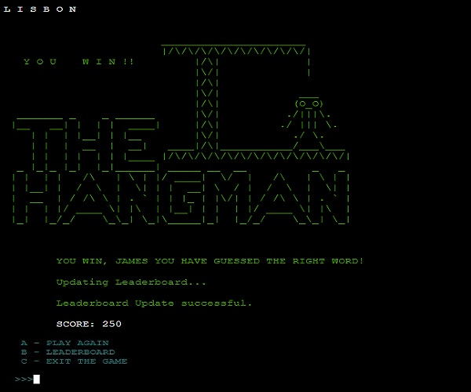
* If the player guessed the full word letter by letter, they will see this feature and will win the game and get 200 points.

### Hangman Stage 10 - Win Extra

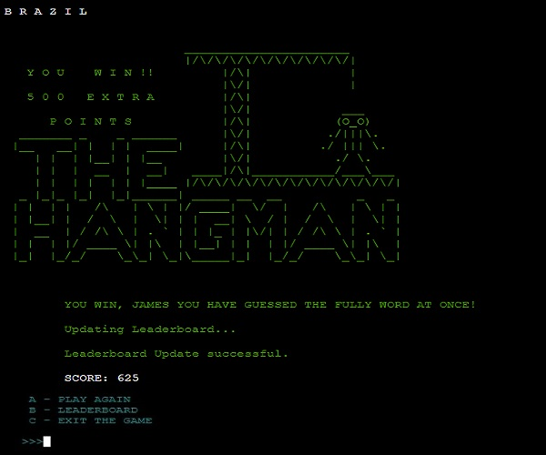
* If the player guessed all the letters that appear in the word there by completing the word or at least guessed no more than 3 correct letters before completing the full word, this feature will appear.

### Menu Options

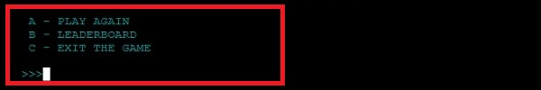
* In the end of the game users will have access to the menu where they can choose from these options:  
[A] - Play Again  
[B] - Leaderboard  
[C] - Exit Game

### Leaderboard
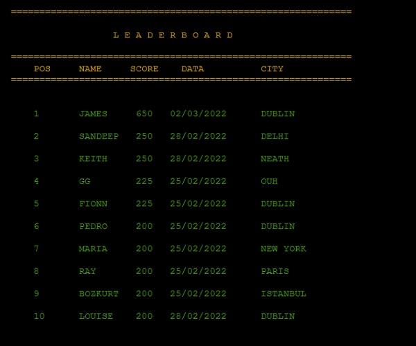
* The Leaderboard shows the 15 players with the best scores.

### Exit Game
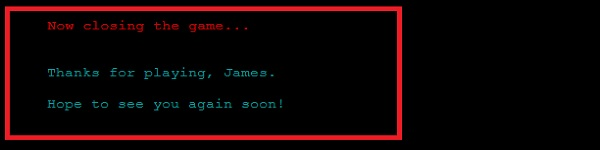
* The players will see this message if they will chose to exit the game by typing [C].

